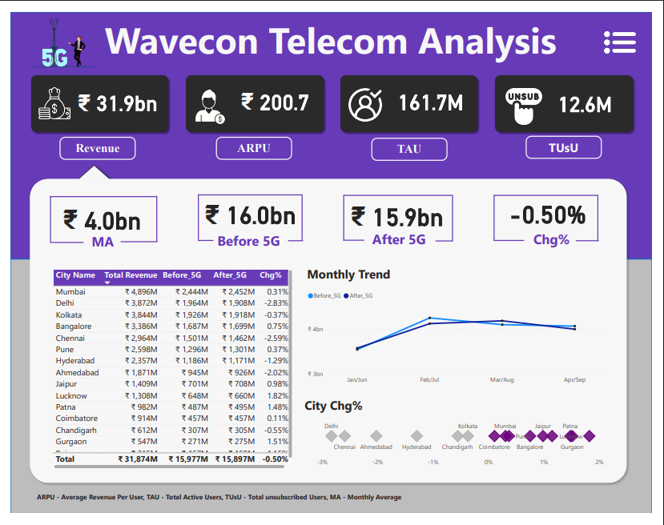
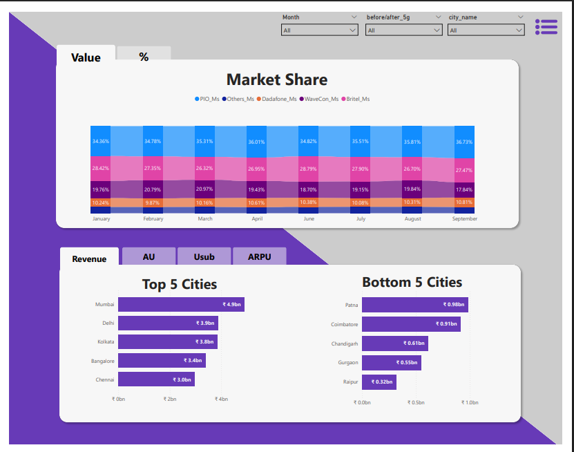
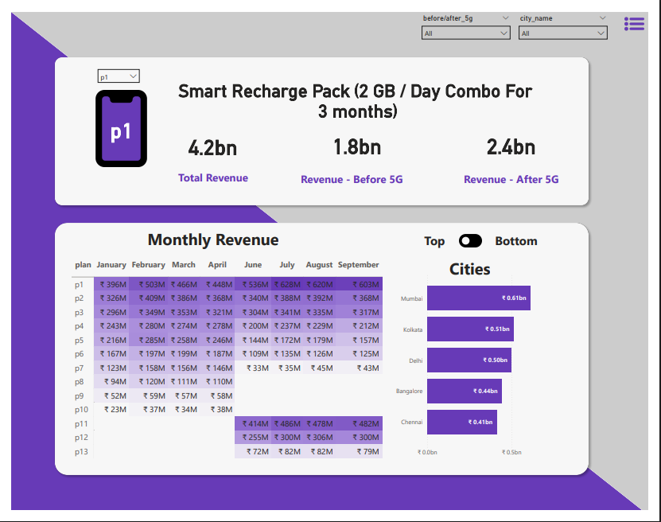

# 📡 WaveCon Telecom Analysis (5G Impact) — Power BI Dashboard  
**Codebasics Virtual Internship | Week 2 Task 4**

This project analyzes the performance of **WaveCon**, a leading telecom company in India, after its **5G launch (May 2022)**.  
The analysis compares metrics **before 5G (Jan–Apr 2022)** vs **after 5G (Jun–Sep 2022)** to understand revenue impact, churn signals, plan performance, and strategic next steps. :contentReference[oaicite:0]{index=0}

## 📌 Project Overview

WaveCon launched 5G to improve monetization and customer experience. However, after launch, the business needed answers to key questions:
- Did 5G improve revenue?
- Which KPIs got worse (churn/active users)?
- Which recharge plans performed well vs declined?
- Which plans should be discontinued or redesigned?
- What actions can improve post-5G performance?

This report converts raw telecom usage + revenue data into a **decision-focused dashboard** with clear KPIs, city-level trends, and plan-level insights. 

## 🎯 Objectives

- Measure **Impact of 5G Launch on Revenue**  
- Identify **Underperforming KPIs** after 5G  
- Perform **Plan Performance Analysis** (before vs after)  
- Detect **Plans heavily affected** by 5G (continue/discontinue)  
- Review **Discontinued Plans** and explain the reason  
- Provide **Strategic Recommendations** to improve performance :contentReference[oaicite:2]{index=2}

## 📊 Key KPIs (Before vs After 5G)

From the analysis:

- **Revenue (Before 5G):** ₹15.97 bn  
- **Revenue (After 5G):** ₹15.89 bn  
- **Revenue Change:** **-0.50%** :contentReference[oaicite:3]{index=3}  

KPI overview highlights:

- **ARPU:** 200.7 (increased post-5G due to premium plan migration)  
- **TAU (Total Active Users):** 161.7M (declined post-5G)  
- **Unsubscribed Users:** 12.6M (increased post-5G) :contentReference[oaicite:4]{index=4}

### 1) Revenue & KPI Overview (City-wise + Trend)
Shows revenue before/after 5G, monthly trend comparison, and city contribution breakdown.  

### 2) Market Share + Top/Bottom Cities
Highlights market share trend across months and top/bottom city performance.  

### 3) Plan Performance (Monthly Revenue + Plan Selector)
Compares plan revenue before vs after 5G and shows monthly plan-wise revenue trends.  

## 🔍 Key Insights

### 1) Impact of 5G on Revenue
- Revenue remained **almost flat**, with a slight decline (**-0.50%**) after 5G launch.  
- Top revenue city: **Mumbai (~₹4.9 bn)**  
- Strong contributors: **Delhi & Kolkata (~₹4 bn each)**  
- Lowest contributors: **Raipur, Gurgaon, Chandigarh (<₹1 bn)** 

### 2) Underperforming KPIs (Post-5G Warning Signals)
- **Active users dropped:** 84M → 77M (**-8.28%**)  
- **Unsubscribed users increased:** 6M → 7M (**+23.50%**)  
This indicates churn increased faster than adoption, which is risky after a major launch. 

City trend notes:
- Biggest active user drops: **Mumbai, Delhi, Kolkata**
- Relatively stable adoption markets: **Hyderabad, Ahmedabad**
- Unsubscribers increased in many cities, especially **Chennai, Kolkata, Bangalore** 
### 3) Plan Performance (Revenue Winners vs Losers)
Top performing plans after 5G:
- **P1, P11, P12** (strong revenue traction post-launch)  
Underperforming legacy plans:
- **P6, P7, P8** (revenue decline suggests migration to newer 5G offerings) 

### 4) Plans Highly Affected (Keep vs Fix vs Drop)
- **P5** revenue dropped **1.0bn → 651.5M** (needs rework/migration offers)
- **P7** revenue dropped **582.4M → 155.6M** (strong candidate for discontinuation) 

### 5) Discontinued Plans (Post-5G)
- **P9 and P10** show **zero revenue after 5G**, indicating discontinuation.
- Likely older low-demand 3G/4G plans that became irrelevant in a 5G-focused market. 
---

## ✅ Strategic Recommendations
Recommended actions to improve post-5G performance:
- **OTT Subscription Bundling** with premium 5G plans to increase plan attractiveness and ARPU
- **Referral-driven growth** (example: free data rewards on active plans)
- **Plan value enhancement** (extra data / extended validity) to improve retention
- **Seasonal promotions** for short-term spikes
- **Incentives for mid-tier plans** (vouchers, tickets, partner rewards)
- **Portfolio optimization:** discontinue weak legacy plans and migrate users to entry-level 5G plans with limited-time incentives 

## 🔧 Workflow (What I Did)
1. Compared **Before vs After 5G** periods (Jan–Apr vs Jun–Sep 2022)
2. Built core KPIs: Revenue, ARPU, Active Users (TAU), Unsubscribed Users
3. Created city-level views:
   - top/bottom city revenue
   - city-wise churn / active user movement
4. Built plan-level analysis:
   - plan revenue before vs after
   - monthly trends + plan selector
5. Summarized insights and proposed recommendations aligned with business outcomes :contentReference[oaicite:12]{index=12}

## 🧠 Skills Used
- Power BI (dashboard building + storytelling)
- Power Query (data cleaning & shaping)
- DAX (measures / KPI calculations)
- Business analysis (churn, ARPU, plan performance)
- Recommendation writing (actionable strategy)

## 💡 Business Value

This dashboard helps:

- **Leadership** quickly evaluate whether the 5G launch is improving revenue and customer retention
- **Revenue teams** identify high-performing cities and focus expansion/marketing where returns are strongest
- **Customer success & retention teams** spot churn increases early (active users down, unsubscribers up) and act with targeted offers
- **Product & pricing teams** compare plan performance before vs after 5G to optimize the plan portfolio (keep, fix, or discontinue plans)
- **Strategy teams** prioritize actions like bundling, promotions, and migration campaigns to improve adoption and reduce churn

└─ README.md
